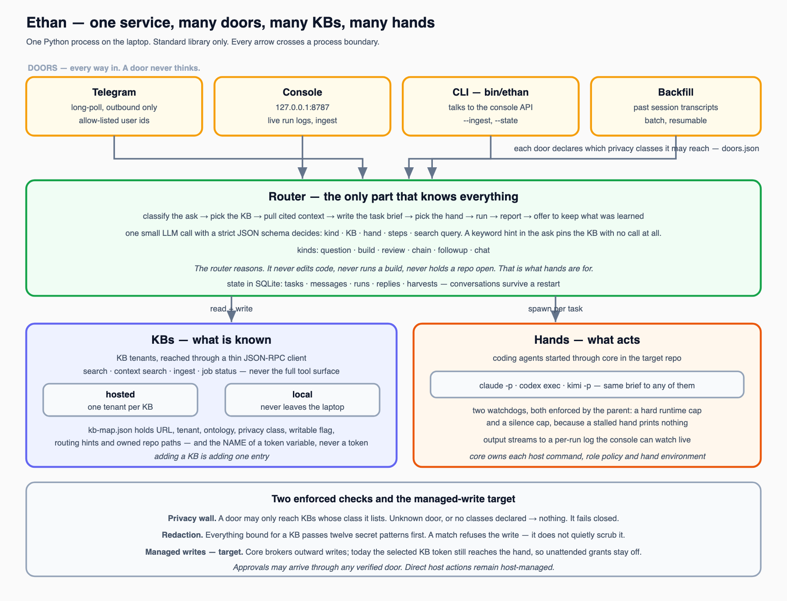
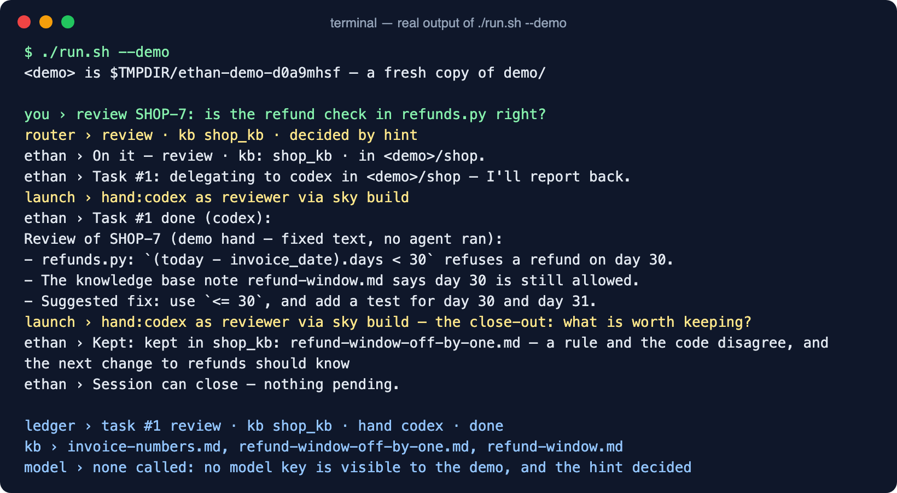
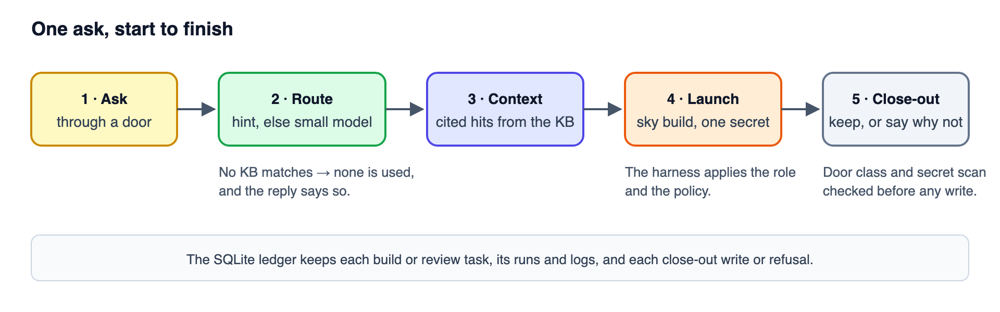

# Ethan

[](https://github.com/arupmmi07/ethan/actions/workflows/tests.yml)
[](https://www.python.org/downloads/)
[](LICENSE)

*The charioteer — steers, never fights.*

Ethan is a personal agent that decides which knowledge base and which coding agent a
task needs, launches the agent under a policy, and files what the run learned back into
the knowledge base. It is one always-on service with several ways in: a local web
console, a command line and Telegram. Ethan does not do the work. It decides who should,
gives them the right context, and records the result. The person stays the authority.



## The problem

Without Ethan you are the operator, every session: pick the knowledge base, pick the
coding agent, write the brief, watch it, then decide what to keep. Ethan takes that
job — not the engineering judgement, the operating.

## Words you need

- **Door** — a way in: the console, the `ethan` command, Telegram.
- **Knowledge base (KB)** — where what you know is stored and searched. A KB can be a
  remote service or a folder of Markdown notes.
- **Hint** — a keyword a KB claims, such as `PROJ-`. An ask that contains it goes to
  that KB without asking a model.
- **Hand** — the coding agent that does the work (Claude Code, Codex, Kimi), started
  through `sky build` from [Skynet Harness](https://github.com/arupmmi07/skynet-harness),
  which applies the role and the policy.
- **Close-out** — after a run, the hand says what is worth keeping, and Ethan checks it
  against policy before writing it to the KB.

## See it work in sixty seconds

You need Python 3.11 or newer and git. No key, no account, no server:

```bash
git clone https://github.com/arupmmi07/ethan.git
cd ethan
./run.sh --demo
```

The demo copies a small sample shop and a two-note KB to a temporary folder and runs one
ask through routing, launch, close-out and the ledger. The router, the KB search, the
brief, the policy checks and the ledger are the real code. The hand is a stand-in,
`demo/fake-sky`, which prints a fixed review instead of starting an agent. This is its
real output:



## Use it in five steps

1. **Install the harness** and put its `core/bin/sky` on your `PATH`, or set `sky.bin`
   in `config/ethan.json`, or export `SKY_BIN`. Without it Ethan still starts and routes,
   and refuses at the point of building with a message saying which of the three to do.
2. **Add your keys.** `cp .env.example .env`, then fill in `OPENAI_API_KEY`. It is used
   only for routing asks that no hint decides.
3. **Describe your KBs.** `cp config/kb-map.example.json config/kb-map.json`, then give
   each KB a specific `purpose`, its `hints` and its privacy class. A KB with a `folder`
   needs no server. See [Routing](docs/routing.md).
4. **Start it.** `./run.sh`. The console opens at `http://127.0.0.1:8787`; if that port is
   taken, Ethan says so and stops, and `ETHAN_CONSOLE_PORT` picks another.
5. **Ask.** From any shell, `bin/ethan "review PROJ-412"`. Ethan prints each step, the
   hand's result, what it kept and whether the session can close.

## What happens on every ask



A hint picks the KB; when the first word names the work (`review`, `fix`, `add`…), the
hint decides alone and no model is called. Otherwise a small model sees only each KB's
purpose and the ask. Ethan pulls cited context from that KB, writes a brief, and starts
the hand through `sky build` with exactly one secret: that KB's token. After the run,
the hand proposes what to keep; Ethan checks the door's privacy class and scans for
secrets before writing. See [Architecture](docs/architecture.md).

## What you get

- Routing by hint first, with a model only when the hint cannot decide; a KB the router
  did not choose is never used.
- Launch through the harness, never a bare agent: an explicit environment, a role and a
  hard time cap.
- Close-out that always reports: kept, nothing kept and why, or refused and why.
- A local console that refuses requests from other web pages and bodies over 64 KB.
- A SQLite ledger of build and review tasks, their runs and logs, and every close-out
  write or refusal.

## What it is not

- Not an agent that approves, merges or pushes. It picks and launches; you decide.
- Not a policy engine. The harness enforces what a run may do; Ethan only chooses.
- Not finished: status and inbox asks, a ledger of every route decision, and a
  privacy wall that is on by default are open rows in the [roadmap](ROADMAP.md).

## Status

Version 0.1.0. 41 tests, standard library only, run by CI on Python 3.11, 3.12 and 3.13:
`python3 -m unittest discover -s tests -t .`. The real hand path needs the harness and has
been tested here only with a fake `sky`. Changes are listed in the [changelog](CHANGELOG.md).

## Links

| | |
|---|---|
| [Architecture](docs/architecture.md) | Doors, router, hands, close-out |
| [Getting started](docs/getting-started.md) | Keys, knowledge bases, first task |
| [Routing](docs/routing.md) | How a task chooses a knowledge base |
| [Roadmap](ROADMAP.md) | Every planned feature, its status and owner |
| [Contributing](CONTRIBUTING.md) | Running the checks, claiming work, docs rules |

## Licence

Apache 2.0. See [LICENSE](LICENSE).
