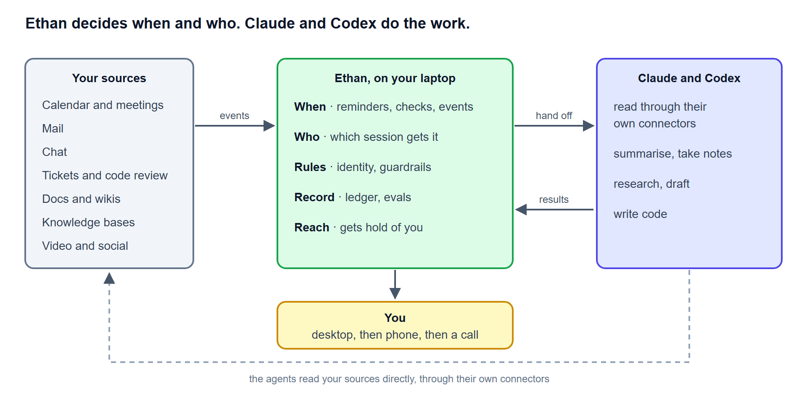

# Vision

Where Ethan is going, written down on 2026-10-04. This page is a direction, not a list
of what works today. Everything here that is not built yet is a row in the
[roadmap](../ROADMAP.md), and a row is the only promise.

## The assistant

Ethan is meant to be an assistant that sits quietly on your laptop and helps with any
kind of work. Some examples:

- **Meetings.** It reminds you before a meeting. Afterwards it takes the notes from the
  transcript and lists who agreed to do what.
- **Tasks.** It reminds you of the tasks that matter, wherever they came from: a mail
  you have to answer, a ticket assigned to you, a promise made in a chat.
- **Chats.** It notices when something important to you comes up in a chat or a call,
  and tells you.
- **Research.** You ask it to find something out, and it comes back with an answer and
  its sources.
- **Reaching you.** When something is urgent, it shows it on the desktop. If you are
  away, it messages your phone. If it is urgent and you still do not answer, it calls.

You connect the sources you want: calendar, mail, chat, tickets, code review, wikis,
video and social sites. A source is either read directly when it is needed, or ingested
and indexed into a knowledge base ahead of time. Both work, and the choice is per
source.

## Ethan does not do the work itself

This is the main design rule. Claude and Codex are already strong at reading, reasoning,
summarising, drafting and writing code. They have their own context engines, and their
own connectors to many of the sources above. Ethan does not rebuild any of that. In most
cases it hands the work to one of them and follows it to the end.

Ethan keeps the jobs those tools do not do on their own:

| Ethan owns | Claude and Codex do |
|---|---|
| **When:** reminders, recurring checks, reacting to an event | Reading a source and saying what matters in it |
| **Who:** which session or agent gets the work | Notes and action items from a transcript |
| **Reach:** getting hold of you, and knowing whether it did | Research, drafts, replies for you to send |
| **Rules:** its own identity, and what it may read, write and send | Code, reviews and documents |
| **Record:** what it was asked, who did it, what came back, what it told you | |
| **Evals:** proof that all of the above behaves | |

Two parts of this exist today. A task goes to a hand through `sky build`. An ask goes to
a session that is already running through a local message bridge
([routing](routing.md#passing-an-ask-to-a-running-session)).

## The must-haves

These are part of every feature, not a later phase.

- **Agent identity.** Ethan acts as itself, never as you and never as another agent.
  Every message it sends, every session it hands work to and every record it writes says
  that Ethan did it, on whose behalf, and through which door.
- **Guardrails.** Reading and reminding are allowed by policy. Anything that leaves
  the laptop in your name waits for your yes: a sent mail, a posted message, a pushed
  commit. Work and personal data stay apart, as the privacy classes already do for
  knowledge bases. Telegram already cannot relay work to a coding session.
- **Evals.** A fixed set of scenarios, run with stub sources and stub agents, checks
  the behaviour that matters. Was the reminder on time? Was the same thing nagged twice?
  Was an important item missed? Did anything go out without a yes? A change that makes
  these worse does not ship.
- **Honest state.** Ethan never says something is done, read or pending when it does not
  know. A queued message is "not read". Delivered is not "done".

## Boundaries

- **Consent.** Recording or reading meetings and work chats can need the consent of
  everyone in them, and an employer's policy decides what is allowed. Ethan works from
  transcripts and exports the meeting tool already makes. It does not record audio.
- **No silent sessions.** Ethan does not start a coding session in place of one you
  named, and it does not wake a closed one.
- **Not a replacement** for your mail, calendar, chat or ticket tools. It reads them,
  through the agents, and points you back to them.

## How we get there

Each step is usable on its own, and each is a row in the roadmap.

1. **Hand off and follow up.** Relay an ask to a running session
   ([EH-058](../ROADMAP.md#eh-058)). Follow it to its answer
   ([EH-059](../ROADMAP.md#eh-059)). Answer "what is pending?"
   ([EH-023](../ROADMAP.md#eh-023)).
2. **Ethan's own clock.** Reminders you set, and recurring checks
   ([EH-061](../ROADMAP.md#eh-061)).
3. **Reaching you.** Desktop, then phone, then a call ([EH-062](../ROADMAP.md#eh-062)).
4. **Sources through the agents.** A recurring "check this source and tell me what
   matters" job, run by an agent through its own connectors
   ([EH-063](../ROADMAP.md#eh-063)). It also covers mail ([EH-028](../ROADMAP.md#eh-028))
   and tickets ([EH-044](../ROADMAP.md#eh-044)).
5. **One task list** gathered from every source ([EH-065](../ROADMAP.md#eh-065)).
6. **Meetings:** notes and action items from transcripts ([EH-064](../ROADMAP.md#eh-064)).
7. **Research asks** with sources ([EH-069](../ROADMAP.md#eh-069)).

Identity ([EH-066](../ROADMAP.md#eh-066)), guardrails ([EH-067](../ROADMAP.md#eh-067))
and evals ([EH-068](../ROADMAP.md#eh-068)) start with step 2 and grow with every step
after it.
